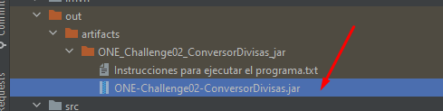

<p align="center">
<a href="https://www.aluracursos.com/"> </a>
<a href="https://www.oracle.com/mx/education/oracle-next-education/"></a>
</p>

# Disclaimer
Tenga en cuenta que el siguiente descargo de responsabilidad se aplica al repositorio que contiene modificaciones 
basadas en una base de código original lanzada bajo la Licencia MIT. 

repositorio base: https://github.com/LanIkari/ONE-Challenge02-ConversorDivisas (MIT LICENSE)
 

# ONE-Challenge02-ConversorDivisas 💱 

<a href="https://www.oracle.com/technetwork/java/javase/downloads/index.html"></a>
<a href="https://openjfx.io/"></a>
<a href="https://maven.apache.org/ref/4.0.0-alpha-4/"></a>
[](https://github.com/firstcontributions/open-source-badges)
[](https://opensource.org/licenses/mit-license.php)


Programa desarrollado como parte de mi formacion en el programa Oracle Next Education G4, en conjunto con ALURA Latam.

Este programa consiste en un conversor de Divisas, en el que se aplican los conocimientos adquiridos en la especializacion como BackEnd.
Ocupando Java como lenguaje de programacion y empleando los conceptos fundamentales en:

- [Java JRE y JDK](https://app.aluracursos.com/course/java-primeros-pasos)
- [Programacion Orientada a Objetos](https://app.aluracursos.com/course/java-parte2-introduccion-orientada-objetos)
- [Polimorfismo](https://app.aluracursos.com/course/java-parte-3-entendiendo-herencia-interfaces)
- [Excepciones](https://app.aluracursos.com/course/java-excepciones)


Por otro lado cuenta con la implementacion de una API para obtener la tasa de cambio actual de las divisas seleccionas en el tiempo de 
ejecucion del programa. El proveedor de dicha Api es [Open Exchange Rates](https://openexchangerates.org/) por lo que siempre que se 
realice alguna conversion esta contara con la tasa de cambio mas actual y real.

<a href="https://openexchangerates.org/"></a>

Asi mismo se ocuparon tecnologias y recursos que mejoran la experiencia de usuario y las funcionalidades del progrma, con
la implementacion de JavaFX y su compativilidad con CSS, que le dan una vista mas estetica e intuitiva a las interfaces.

<a href="https://openjfx.io/"> </a>


Puedes ver el desafio en: [Challenge ONE Back End - Java](https://www.aluracursos.com/challenges/oracle-one-back-end/conversordemoneda/sprint01) :books:

## Badge ONE :1st_place_medal:
<p align="center">
<a href="https://d335luupugsy2.cloudfront.net/cms%2Ffiles%2F10224%2F1671211831Prancheta_8.png?utm_campaign=alura_latam_-_challenge_email_projeto_5_esp&utm_medium=email&utm_source=RD+Station"></a>
</p>

## Construido con :hammer_and_wrench:

* Java 💀
* CSS 🎩
* JavaFX 👾


## Prueba mi proyecto 🔗
Debido a que este proyecto se desarrollo en JavaFX es un poco mas laborioso el poder ejecutarlo ya que debes deseguir una
serie de pasos para poder ejecutar el .jar en tu equipo local. Pero no te preocupes, yo te guiare para que no tengas 
problemas ni dificultades.

1. Puedes descargar solo el ejectuable en tu equipo local. Este se encuentra en la carpeta:card_index_dividers: : out/artifacts

<a href="out/artifacts/ONE_Challenge02_ConversorDivisas_jar/ONE-Challenge02-ConversorDivisas.jar" download="ONE-Challenge02-ConversorDivisas" class="JAR"> <button style="height: 40px; margin-left: 310px">Divisas.jar</button> </a>

2. Tambien debes de descargar una version de [JavaFX](https://openjfx.io/), la que estes disponible actualmente, descomprimir el archivo zip para que dispongas de todas las funcionalidades de JavaFX

3. Abre una terminal en donde tengas el jar y ejecuta el siguiente comando:
```
set PATH_TO_FX="AQUI VA LA RUTA EN DONDE TIENES JAVAFX, APUNTANDO A LA CARPETA lib"

java --module-path %PATH_TO_FX% --add-modules javafx.base,javafx.graphics,javafx.controls,javafx.fxml -jar ONE-Challenge02-ConversorDivisas.jar
```

En el siguiente video puedes ver una guia rapida para ejecutar el progrma.

<br>
<p align="center">
  
</p>
<br>

## how to build the jar 
ve a el menu si usas intellij, https://www.jetbrains.com/help/idea/packaging-javafx-applications.html#build-artifacts


luego selecciona  build en el menu emergente 


se debe de actualizar el .jar en la ruta




## Trello - Sprint :card_file_box:

Puedes ver y comprobar mi ritmo de desarrollo apegado a una metodologia agil en el [tablero de Trello](https://trello.com/invite/b/9ouy810V/ATTIac4f268d1c194e7be72d2624e8f867d675B50864/one-challenge-conversor-divisas), 
que se creo especialmente para este desafio.

<a href="https://trello.com/invite/b/9ouy810V/ATTIac4f268d1c194e7be72d2624e8f867d675B50864/one-challenge-conversor-divisas"> </a>


